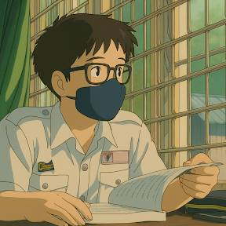

</img>

<h1 align="center">Hi there 👋 I am Wei Shan! 🐱</h1>
<h6 align="center">You can also call me Lukas if you want too!</h6>
 

  
  
  
  
  
  
  
  
  
  
  

<h2 align="center">Know More About Me 😊</h2>

  <table style="border: none; border-radius: 12px; background-color: #f0f0f0; padding: 20px; width: 80%; max-width: 600px; box-shadow: 0 4px 10px rgba(0,0,0,0.1);">
    <tr>
      <td style="border: none; font-family: sans-serif; font-size: 16px; line-height: 1.6;">
        
<strong>Name:</strong> How Wei Shan (侯韦杉)

        
<strong>Location:</strong> Johor Bahru, Johore, Malaysia 🇲🇾

        
<strong>Occupation:</strong> Full-time student 👨‍🎓 @ Monash University, Malaysia

        
<strong>Hobbies:</strong> Coding⌨️, Photography📸

        
<strong>Ambition:</strong> Full-stack Developer🖥

      </td>
    </tr>
  </table>

Coding is my life-saver, or better known as a life guide. In lockdown, while I was wasting my time in Minecraft, coding change me - it let me find myself another way for my life instead of studying. 

Starting from basic programming (using Python), and then front-end development (nodeJS), and now competitive programming (C++), I learnt a lot more than just coding - new friendcircle, new community, and also knew about what friend should I avoid.

In 2022, competitive programming brought me to another diversity...although I did less effort. It totally change me, bringing me more confidences and be brave. Also, it brings me motivations in my life, plus making me more self-disciplined.

# Contact Me ✉

- Discord: lukashow
- Facebook/Messenger/Instagram: howweishan0210
- Email: howweishan0210@outlook.com

<!--
**lukashow/lukashow** is a ✨ _special_ ✨ repository because its `README.md` (this file) appears on your GitHub profile.

Here are some ideas to get you started:

- 🔭 I’m currently working on ...
- 🌱 I’m currently learning ...
- 👯 I’m looking to collaborate on ...
- 🤔 I’m looking for help with ...
- 💬 Ask me about ...
- 📫 How to reach me: ...
- 😄 Pronouns: ...
- ⚡ Fun fact: ...
-->
